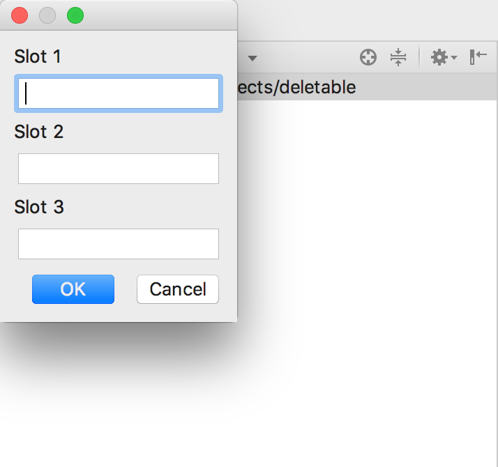

# Kwick Actions


## About
Since there wasn't a straight forward way to have a keyboard shortcut map to a shell command, this small plugin lets you store up to 3 commands that you can create a custom keyboard shortcut for.

## How to use

After installing the plugin, there will be a `kwick` titled drop down menu added in the main menu which looks like this.


The `Edit Kwick Commands` option will popup a dialog box that looks like this.



Add whatever commands you want to into the text fields and the `OK` button will save the commands.

Kwick Actions only provides this storing of a terminal command to an action. To create a shortcut of these commands, open 

Preferences -> Keymap

and search for kwick, something like this should popup.


Here you can create a keyboard shortcut to the command you've run.  

## Example

Due to the `exec` command only running a single command each time, multiple shell commands are not yet supported, however writing them into a shell script and executing the script itself will work instead.

Code from script named `git_sub_update.sh` that updates the git submodules in a specific repo

```
#!/usr/bin/env bash

cd /Users/p/IdeaProjects/deletable
git submodule update --recursive --remote

```